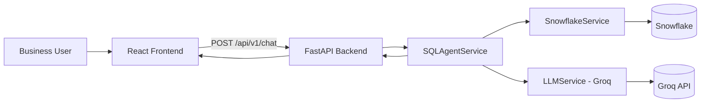
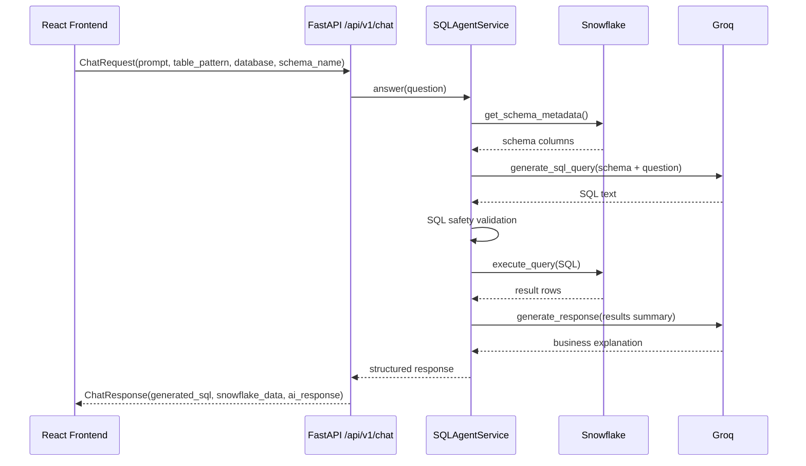

# Enterprise AI Analytics Platform

Production-oriented analytics platform that lets users ask business questions in natural language and receive:
- generated Snowflake SQL,
- executed query results,
- and an AI-written business explanation.

The platform is split into independent services for clean containerization and deployment.

## Tech Stack
- Frontend: React + Vite + TypeScript
- Backend: FastAPI + Pydantic v2
- Data Warehouse: Snowflake
- LLM: Groq (OpenAI-compatible API)
- Containers: Docker + Docker Compose
- Cloud Target: AWS ECS Fargate
- CI/CD Target: GitHub Actions

## Architecture Overview



### Repository Layout
```text
.
├─ frontend/                  # React UI
├─ backend/                   # FastAPI API
│  ├─ app/
│  │  ├─ routers/             # health, chat endpoints
│  │  ├─ schemas/             # request/response models
│  │  └─ services/            # Snowflake, Groq, SQL orchestration
│  ├─ Dockerfile
│  ├─ requirements.txt
│  └─ .env
├─ docker-compose.yml
└─ README.md
```

## API Flow (End-to-End)



### SQL Safety Controls
The orchestrator blocks dangerous operations before execution, including:
- DDL/DML: DROP, DELETE, TRUNCATE, INSERT, UPDATE, ALTER, CREATE, MERGE, REPLACE
- Privilege/exec operations: GRANT, REVOKE, EXECUTE, CALL
- Injection patterns: stacked statements and SQL comment abuse

## Local Setup

## Prerequisites
- Python 3.11+
- Node.js 20+
- Docker Desktop (optional but recommended)
- Snowflake account and credentials
- Groq API key

## Option A: Docker Compose (recommended)
1. Create or update backend environment file:
   - copy backend/.env.example to backend/.env
2. Set required values in backend/.env (Snowflake + Groq).
3. Run:

```bash
docker compose up --build
```

4. Access services:
- Frontend: http://localhost:5173
- Backend API docs: http://localhost:8000/docs
- Health endpoint: http://localhost:8000/api/v1/health

## Option B: Run services directly

### Backend Setup
1. Go to backend folder:

```bash
cd backend
```

2. Create virtual environment and install dependencies:

```bash
python -m venv .venv
.venv\Scripts\activate
pip install -r requirements.txt
```

3. Prepare environment:
- copy backend/.env.example to backend/.env
- set Snowflake and Groq values

4. Start API:

```bash
uvicorn app.main:app --reload --host 0.0.0.0 --port 8000
```

### Frontend Setup
1. Go to frontend folder:

```bash
cd frontend
```

2. Install dependencies:

```bash
npm install
```

3. Start dev server:

```bash
npm start
```

4. Build production assets:

```bash
npm run build
```

## Core API Contract

### POST /api/v1/chat
Request body:
```json
{
  "prompt": "What are the top 10 customers by revenue last month?",
  "session_id": "session-001",
  "model": "llama-3.3-70b-versatile",
  "table_pattern": "%",
  "database": "ANALYTICS_DB",
  "schema_name": "PUBLIC"
}
```

Response body (shape):
```json
{
  "session_id": "session-001",
  "model": "llama-3.3-70b-versatile",
  "question": "What are the top 10 customers by revenue last month?",
  "generated_sql": "SELECT ...",
  "snowflake_data": [{"customer_id": 1, "revenue": 98000.0}],
  "row_count": 10,
  "ai_response": "Revenue is concentrated among top customers...",
  "dialect": "Snowflake SQL",
  "timestamp": "2026-05-25T10:00:00+00:00",
  "success": true,
  "error": null
}
```

## Environment Variables (Backend)
Required or commonly used values in backend/.env:
- APP_NAME
- APP_VERSION
- ENVIRONMENT
- ALLOWED_ORIGINS
- SNOWFLAKE_ACCOUNT
- SNOWFLAKE_USER
- SNOWFLAKE_PASSWORD
- SNOWFLAKE_DATABASE
- SNOWFLAKE_SCHEMA
- SNOWFLAKE_WAREHOUSE
- SNOWFLAKE_ROLE
- GROQ_API_KEY
- GROQ_DEFAULT_MODEL
- GROQ_REQUEST_TIMEOUT
- GROQ_MAX_RETRIES

## AWS ECS Fargate Deployment Pattern
Recommended target architecture:
- ECR repositories:
  - frontend image
  - backend image
- ECS cluster with two Fargate services:
  - frontend service (Nginx container)
  - backend service (FastAPI container)
- Application Load Balancer routing:
  - / to frontend
  - /api/* to backend
- AWS Secrets Manager or SSM Parameter Store for backend secrets
- CloudWatch Logs for both services

## GitHub Actions CI/CD Pattern
Suggested workflows:
- CI workflow (on pull_request):
  - frontend lint + build
  - backend import/syntax checks
  - docker image build validation
- CD workflow (on main):
  - build and push frontend/backend images to ECR
  - deploy updated task definitions to ECS Fargate

## Future Roadmap
- Add JWT/OIDC authentication and role-based access control
- Add query history, saved dashboards, and audit logging
- Add caching layer and result pagination for large datasets
- Add observability stack: metrics, tracing, structured request IDs
- Add automated tests (unit, integration, contract, e2e)
- Add policy engine for stricter SQL governance and allow-listing
- Add semantic model layer for business glossary and metric definitions
- Add multi-tenant isolation and per-tenant Snowflake routing
